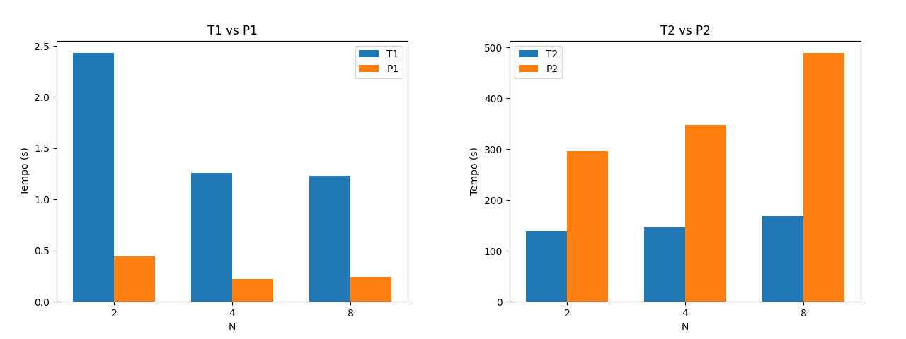

# O Duelo de Contextos: Processos vs. Threads

André Carvalho e Guilherme Alves

## 1. Assinatura do Hardware

O experimento foi executado em ambiente Linux, no processador Intel Core i5-13420H.

Resumo do hardware:

| Item | Valor |
| --- | --- |
| Arquitetura | x86_64 |
| Processador | 13th Gen Intel(R) Core(TM) i5-13420H |
| CPUs lógicas | 12 |
| Núcleos por soquete | 8 |
| Threads por núcleo | 2 |
| Soquetes | 1 |
| Frequência máxima | 4600 MHz |
| Frequência mínima | 400 MHz |

Saída do comando `lscpu`:

```
Arquitetura:                  x86_64
  Modo(s) operacional da CPU: 32-bit, 64-bit
  Tamanhos de endereço:       39 bits physical, 48 bits virtual
  Ordem dos bytes:            Little Endian
CPU(s):                       12
  Lista de CPU(s) on-line:    0-11
ID de fornecedor:             GenuineIntel
  Nome do modelo:             13th Gen Intel(R) Core(TM) i5-13420H
    Família da CPU:           6
    Modelo:                   186
    Thread(s) per núcleo:     2
    Núcleo(s) por soquete:    8
    Soquete(s):               1
    Step:                     2
    CPU(s) MHz de escala:     29%
    CPU MHz máx.:             4600,0000
    CPU MHz mín.:             400,0000
    BogoMIPS:                 5222,40
    Opções:                   fpu vme de pse tsc msr pae mce cx8 apic sep mtrr p
                              ge mca cmov pat pse36 clflush dts acpi mmx fxsr ss
                              e sse2 ss ht tm pbe syscall nx pdpe1gb rdtscp lm c
                              onstant_tsc art arch_perfmon pebs bts rep_good nop
                              l xtopology nonstop_tsc cpuid aperfmperf tsc_known
                              _freq pni pclmulqdq dtes64 monitor ds_cpl vmx smx
                              est tm2 ssse3 sdbg fma cx16 xtpr pdcm pcid sse4_1
                              sse4_2 x2apic movbe popcnt tsc_deadline_timer aes
                              xsave avx f16c rdrand lahf_lm abm 3dnowprefetch cp
                              uid_fault epb ssbd ibrs ibpb stibp ibrs_enhanced t
                              pr_shadow flexpriority ept vpid ept_ad fsgsbase ts
                              c_adjust bmi1 avx2 smep bmi2 erms invpcid rdseed a
                              dx smap clflushopt clwb intel_pt sha_ni xsaveopt x
                              savec xgetbv1 xsaves split_lock_detect user_shstk
                              avx_vnni dtherm ida arat pln pts hwp hwp_notify hw
                              p_act_window hwp_epp hwp_pkg_req hfi vnmi umip pku
                               ospke waitpkg gfni vaes vpclmulqdq rdpid movdiri
                              movdir64b fsrm md_clear serialize arch_lbr ibt flu
                              sh_l1d arch_capabilities
Recursos de virtualização:
  Virtualização:              VT-x
Caches (soma de todos):
  L1d:                        320 KiB (8 instâncias)
  L1i:                        384 KiB (8 instâncias)
  L2:                         7 MiB (5 instâncias)
  L3:                         12 MiB (1 instância)
NUMA:
  Nó(s) de NUMA:              1
  CPU(s) de nó0 NUMA:         0-11
Vulnerabilidades:
  Gather data sampling:       Not affected
  Ghostwrite:                 Not affected
  Indirect target selection:  Not affected
  Itlb multihit:              Not affected
  L1tf:                       Not affected
  Mds:                        Not affected
  Meltdown:                   Not affected
  Mmio stale data:            Not affected
  Old microcode:              Not affected
  Reg file data sampling:     Mitigation; Clear Register File
  Retbleed:                   Not affected
  Spec rstack overflow:       Not affected
  Spec store bypass:          Mitigation; Speculative Store Bypass disabled via
                              prctl
  Spectre v1:                 Mitigation; usercopy/swapgs barriers and __user po
                              inter sanitization
  Spectre v2:                 Mitigation; Enhanced / Automatic IBRS; IBPB condit
                              ional; PBRSB-eIBRS SW sequence; BHI BHI_DIS_S
  Srbds:                      Not affected
  Tsa:                        Not affected
  Tsx async abort:            Not affected
  Vmscape:                    Mitigation; IBPB before exit to userspace
```

## 2. Tabela de Tempos

A tabela abaixo usa a média do tempo real das 5 execuções (Dados brutos usados estão no repositório, em ./resultados.txt).

| Cenário | Sincronização | N = 2 | N = 4 | N = 8 |
| --- | --- | --- | --- | --- |
| T1 - Threads | Sem sincronização | 2,43 s | 1,26 s | 1,23 s |
| T2 - Threads | `pthread_mutex` | 138,64 s | 145,42 s | 167,71 s |
| P1 - Processos | Sem sincronização | 0,44 s | 0,22 s | 0,24 s |
| P2 - Processos | `sem_open` | 296,30 s | 346,98 s | 488,72 s |

## 3. Análise de Corrupção

Nos experimentos T1 e P1, o contador não chegou a `1.000.000.000` porque várias unidades de execução acessaram o mesmo contador ao mesmo tempo, sem proteção. A operação de incremento não é atômica: ela envolve leitura, soma e escrita. Quando duas threads ou dois processos fazem isso simultaneamente, uma escrita pode sobrescrever a outra, causando perda de incrementos.

### T1 - Threads sem sincronização

| N | Execução 1 | Execução 2 | Execução 3 | Execução 4 | Execução 5 |
| --- | --- | --- | --- | --- | --- |
| 2 | 502484905 | 503548313 | 511480161 | 503803026 | 517135212 |
| 4 | 256887624 | 267387268 | 253756279 | 295049573 | 301289731 |
| 8 | 235907293 | 250322789 | 213617877 | 243328856 | 280759900 |

Em T1, todas as execuções terminaram abaixo de `1.000.000.000`. Com N = 2, os valores ficaram próximos de 500 milhões. Com N = 4 e N = 8, a perda foi ainda maior.

### P1 - Processos sem sincronização

| N | Execução 1 | Execução 2 | Execução 3 | Execução 4 | Execução 5 |
| --- | --- | --- | --- | --- | --- |
| 2 | 521209688 | 520938212 | 513081254 | 518515662 | 530904438 |
| 4 | 266309201 | 290680823 | 264639863 | 262214385 | 252774170 |
| 8 | 322154855 | 275392947 | 372952149 | 304886574 | 267960481 |

Em P1, a memória compartilhada permitiu que os processos acessassem o mesmo contador, mas não protegeu o acesso. Por isso, também houve perda de incrementos.

A máquina usada possui 12 CPUs lógicas. Isso aumenta a chance de execução paralela real nas threads e processos. Com mais unidades de execução, ocorrem mais acessos concorrentes ao contador, aumentando a chance de corrupção. A variação entre execuções ocorre por causa do escalonamento do sistema operacional.

## 3.1. Comparação com outra Máquina

Na outra máquina (2 vCPUs x86_64, VM com hypervisor Microsoft, CPU exposta como AMD EPYC 7763), **T1** terminou com contador `558.180.006` (N = 2), `309.649.073` (N = 4) e `311.389.593` (N = 8). **P1** terminou com `706.723.764`, `370.306.077` e `225.888.050`, respectivamente. Em todos os casos, **não** chegou a 1 bilhão porque o incremento não é atômico e há *race condition* na região crítica, como na seção 3.

A diferença de hardware (2 vCPUs e ambiente virtualizado frente a 12 CPUs lógicas na máquina local) altera o padrão de execução nas threads e processos e, com isso, a frequência de colisões na leitura-modificação-escrita, de modo que os contadores finais numéricos não coincidem com os da tabela acima, mas a natureza do erro e o fato de o valor continuar muito abaixo de 1 bilhão permanecem os mesmos.

## 4. Gráfico de Escalabilidade

O gráfico abaixo mostra o tempo real médio de execução em função do número de trabalhadores.



Dados usados no gráfico:

| Cenário | N = 2 | N = 4 | N = 8 |
| --- | --- | --- | --- |
| T1 | 2,43 s | 1,26 s | 1,23 s |
| T2 | 138,64 s | 145,42 s | 167,71 s |
| P1 | 0,44 s | 0,22 s | 0,24 s |
| P2 | 296,30 s | 346,98 s | 488,72 s |

## 5. Conclusão

Os experimentos evidenciam uma diferença clara entre desempenho e correção. Os cenários T1 e P1 foram os mais rápidos, porém produziram resultados incorretos devido à ausência de sincronização. Nesse caso, múltiplas threads ou processos acessam simultaneamente o mesmo valor do contador, resultando em perda de incrementos e um valor final inferior a 1.000.000.000.

Esses resultados refletem apenas o custo de execução sem proteção, e não o custo de garantir consistência.

Nos cenários com sincronização, T2 apresentou melhor desempenho que P2 em todos os casos. Para N = 2, 4 e 8, T2 registrou tempos de 138,64 s, 145,42 s e 167,71 s, enquanto P2 apresentou 296,30 s, 346,98 s e 488,72 s. Isso indica que, ao garantir consistência, threads possuem menor overhead que processos.

A principal razão está no modelo de memória. Threads compartilham naturalmente o mesmo espaço de endereçamento e utilizam mutex (pthread_mutex) para sincronização. Já processos requerem memória compartilhada (shmget/shmat) e sincronização via semáforos (sem_open), o que implica maior intervenção do sistema operacional, especialmente nas operações de sincronização.

Mesmo em uma máquina com 12 CPUs lógicas (8 núcleos com hyperthreading), o contador protegido torna-se um gargalo, pois apenas uma thread ou processo pode acessar a região crítica por vez. Como consequência, o aumento de N não melhora o desempenho nos cenários sincronizados, apenas intensifica a contenção, especialmente no modelo com processos.

Assim, embora os cenários sem sincronização sejam mais rápidos, não são corretos. Considerando simultaneamente corretude e desempenho, T2 é o cenário mais eficiente, alcançando o valor final correto com menor overhead. Em conclusão, threads apresentam melhor eficiência de comunicação e menor custo de sincronização para este tipo de problema.